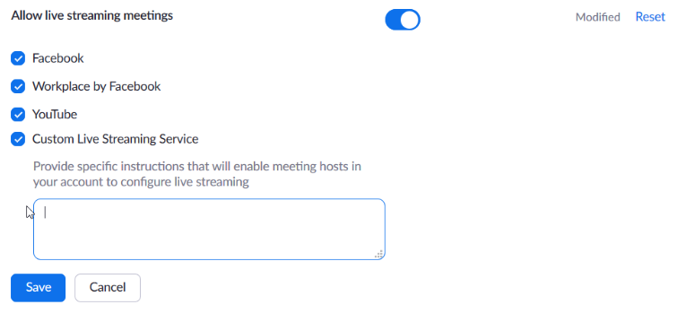

# Streaming to Twitch and YouTube with Zoom

This guide will help you setup Zoom to stream to Twitch or YouTube. 

Before you start you'll need:

- A paid Zoom account. Streaming is not available for free accounts
- A free Twitch account (if you're streaming to Twitch)
- A free YouTube account (if you're streaming to YouTube)

Understand that Zoom will only stream to a single destination. If you need to stream to multiple destinations at the same time (for example Twitch _and_ YouTube at the same time) you'll need a restreaming service like restream.io

## Getting streaming info from Twitch

You can stream to Twitch in Zoom but it is not natively supported. Fortunately, you can setup a custom streaming destination. To do this you'll need to collect some information from Twitch first.

### Info needed by Zoom

There are three pieces of info that Zoom wants to setup a costume streaming destination

- Streaming URL
- Streaming key
- Live streaming page URL

#### Streaming URL

The streaming URL for Twitch is:

rtmp://live.twitch.tv/app

This is the stream destination URL. It should be the same regardless of the streaming application you're using (for example, it should work for OBS)

#### Streaming Key

To find the streaming key you need to login to your Twitch account. You can follow these steps:
 
- Login to your Twitch account
- Click on you account icon/avatar (upper right)
- Click on “Setting” in drop down menu
- Click on “Channel and Videos” tab 
- Find the entry for  “Primary Stream Key” (should be right at the top)
- Click “Copy”

You now have your Primary Stream Key in your clipboard. This key shouldn't change unless you regenerate it. Keep it safe. It is a secret. If someone gets your streaming key they could stream to your Twitch account without your permission. You can paste it into a temporary document for now. We'll need it later on.

#### Live Streaming URL

This is the URL to your twitch account channel. It will be:

https://www.twitch.tv/<username> 

Where <username> is your Twitch account username. You can go to your Twitch channel web page and copy it from there if needed.

For the Aerospace Village, the twitch account channel URL is:

https://www.twitch.tv/aerospacevillage

Is is a public address so it is not a secret.

## Enabling Zoom streaming

Streaming in Zoom is not enabled by default. You'll need to enable it. You can follow these steps:

- Login to your Zoom account on the web page
- Go to Settings
- Select the “Meeting” Tab
- Scroll all the way down (about 3/4 down the page) to “Allow live streaming”
- Click the slider button to enable streaming
- Click “Custom Live Streaming” to enable live streaming to a custom destination

You can also click “Facebook”, “Workplace by Facebook” or “YouTube” now if you intend to stream to those destinations.

When you click on "Custom Live Streaming Service" a text box will open up. You can put a note to the host here. It would be good to put the three pieces of information here: Streaming URL, Streaming key and, Live streaming page URL. Although, you might not want to provide the streaming key for security reasons. If so, you'll need to know the key when you start the streaming later on. 

This is a screen grab of the dialog:

## Streaming to Twitch while in a Zoom meeting

At this point we should have all the informaiton that Zoom need to stream to Twitch and we should have Zoom configured to stream to a custom destination (Twitch). 

Once the meeting is started, you can follow these steps to start streaming:

- As the host, start the Zoom meeting as you normally would
- Once started, go to the bottom menu bar in your meeting window. 
- Click on the "More" button
- A menu of streaming destinations will open up
- Select "Live on Custom Live Streaming Service"
- Zoom will open a web page in your browser
- The page will ask you for the Streaming URL, Streaming key and, Live streaming page URL
- If you put these in the note to the host that information will be displayed
- Click "Go Live"

Zoom will take a few seconds to get the stream setup. A web page will open up to your Twitch channel. You should see on the Twitch channel that the stream is starting. If everything has gone well you should be live streaming to Twitch!

Know that there will be a delay between what you're seing on the Zoom meeting and the stream on Twitch. I've experienced about 15 seconds but it may be different for you depending on your network speed and such.

My experience was that the video on Twitch was higher quality than the video in the Zoom meeting. Not sure if this will be true for everyone.

Zoom will put a Zoom logo on the lower right corner of the Twitch video stream. Personally I don't appreciate this since I'm paying for the service and shouldn't be forced to advertise for them. 

----

Streaming Key: <streaming key>
Live Streaming URL: https://www.twitch.tv/aerospacevillage

Info needed from Twitch:

Stream URL is the same for any stream to twitch which is 
rtmp://live.twitch.tv/app

Streaming Key is obtained from your twitch account

Configure Twitch to record streams:
While in the  “Channel and Videos” tab scroll down to “Store past broadcasts” and enable that. For free accounts it will keep past streams for 14 days.

Setting up Zoom to enable Twitch streaming
To stream with Zoom you must have a paid account

Login to your Zoom account on the web page
Goto Settings
Select the “Meeting” Tab
Scroll all the way down (about ¾ down the page) to “Allow live streaming”
Click “Custom Live Streaming” to enable live streaming to a custom destination
You can also click “Facebook”, “Workplace by Facebook” or “YouTube” if you intend to stream to those destinations.
